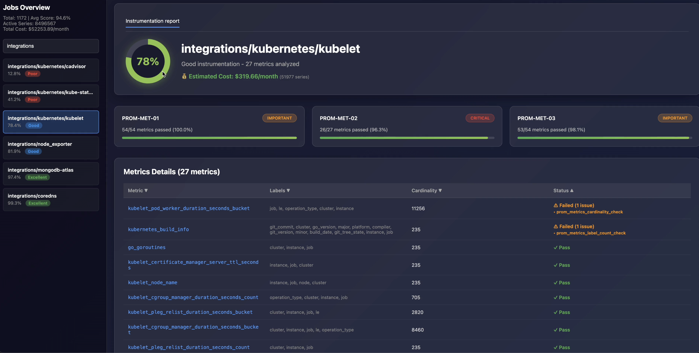

# Instrumentation Score Service

> **Evaluate and improve your Prometheus metrics quality with automated scoring**

A production-ready tool that analyzes Prometheus metrics against [instrumentation best practices](https://github.com/instrumentation-score/spec), providing actionable insights to improve observability quality, reduce costs, and maintain healthy metrics.

[](https://github.com/chit786/instrumentation-score/actions)
[](https://golang.org/)
[](https://opensource.org/licenses/MIT)
[](https://github.com/instrumentation-score/spec)

---

## 🎬 Demo

[](https://github.com/user-attachments/assets/f584d2d3-91eb-4a3e-84d3-f2aadfa93bb7)

*Demo showing metrics analysis, scoring, and HTML report generation*

---

## Table of Contents

- [About](#-about)
- [Quick Start](#-quick-start)
- [Installation](#-installation)
- [Commands](#-commands)
- [Configuration](#-configuration)
- [S3 Integration](#-s3-integration)
- [Rule System](#-rule-system)
- [Output Formats](#-output-formats)
- [CI/CD Integration](#-cicd-integration)
- [Troubleshooting](#-troubleshooting)

---

## 📖 About

### Spec-Compliant Implementation

This project implements the [Instrumentation Score specification](https://github.com/instrumentation-score/spec) - originally designed for OpenTelemetry (OTLP), now extended to support **Prometheus-compatible metrics**.

**Why this matters:**
- 📊 Standardized quality measurement across observability stacks
- 🎯 Proven scoring methodology from the OpenTelemetry community
- 🔄 Vendor-neutral, community-driven approach

### Key Features

- ✅ **Automated Scoring:** Quality scores (0-100) per job/service
- ✅ **Declarative Rules:** Define custom rules in YAML
- ✅ **Multi-Format Output:** HTML, JSON, Text, Prometheus metrics
- ✅ **Cost Estimation:** Calculate storage costs based on cardinality
- ✅ **S3 Integration:** Store and retrieve reports from S3
- ✅ **CI/CD Ready:** Easy integration with GitHub Actions, Jenkins, etc.
- ✅ **Performance Tuned:** Configurable concurrency for optimal speed

---

## 🚀 Quick Start

### 1. Set Credentials

```bash
export login="user:api_key"
export url="https://your-prometheus-instance.com/api/prom"
```

### 2. Analyze Metrics

```bash
instrumentation-score analyze \
  --output-dir ./reports \
  --collect-label-cardinality
```

### 3. Evaluate & Get Scores

```bash
# All jobs with HTML report
instrumentation-score evaluate \
  --job-dir reports/job_metrics_*/ \
  --output html \
  --html-file report.html \
  --show-costs \
  --cost-unit-price 0.00615
```

### 4. View Results

Open `report.html` for an interactive dashboard with:
- 📊 Quality scores per job (0-100)
- 💰 Cost breakdown
- 🎯 Per-metric failure details
- 💡 Actionable recommendations

---

## 📦 Installation

### Option 1: Pre-built Binary (Recommended)

Download from the [releases page](https://github.com/chit786/instrumentation-score/releases):

```bash
# Linux (amd64)
wget https://github.com/chit786/instrumentation-score/releases/latest/download/instrumentation-score-linux-amd64
chmod +x instrumentation-score-linux-amd64
sudo mv instrumentation-score-linux-amd64 /usr/local/bin/instrumentation-score

# macOS (Apple Silicon)
wget https://github.com/chit786/instrumentation-score/releases/latest/download/instrumentation-score-darwin-arm64
chmod +x instrumentation-score-darwin-arm64
sudo mv instrumentation-score-darwin-arm64 /usr/local/bin/instrumentation-score

# macOS (Intel)
wget https://github.com/chit786/instrumentation-score/releases/latest/download/instrumentation-score-darwin-amd64
chmod +x instrumentation-score-darwin-amd64
sudo mv instrumentation-score-darwin-amd64 /usr/local/bin/instrumentation-score
```

### Option 2: Docker

```bash
docker pull ghcr.io/chit786/instrumentation-score:latest
```

### Option 3: Build from Source

```bash
git clone https://github.com/chit786/instrumentation-score.git
cd instrumentation-score
go build -o instrumentation-score .
```

---

## 📋 Commands

### `analyze`

Collect metrics from Prometheus/Mimir and group by job.

```bash
instrumentation-score analyze \
  --output-dir ./reports \
  --collect-label-cardinality \
  --additional-query-filters 'cluster=~"prod.*"'
```

**Required Environment Variables:**
- `url`: Prometheus API URL
- `login`: Basic auth credentials (format: `user:password`)

**Key Flags:**
- `--output-dir`: Where to save reports (required)
- `--collect-label-cardinality`: Enable accurate per-label cardinality (recommended for Mimir)
- `--additional-query-filters`: PromQL filters to limit scope
- `--retry-failures-count`: Retry attempts for transient failures (default: 2)
- `--s3-upload`: Upload results to S3

**Output:**
- `job_metrics_TIMESTAMP/`: Per-job metric files
- `metrics_errors_TIMESTAMP.txt`: Error log

### `evaluate`

Evaluate metrics against rules and generate reports.

```bash
# Evaluate single job
instrumentation-score evaluate \
  --job-file reports/job_metrics_*/api-service.txt \
  --output html \
  --html-file report.html

# Evaluate all jobs
instrumentation-score evaluate \
  --job-dir reports/job_metrics_*/ \
  --output html,json,prometheus \
  --html-file dashboard.html \
  --json-file results.json \
  --prometheus-file metrics.prom \
  --show-costs \
  --cost-unit-price 0.00615

# Evaluate from S3
instrumentation-score evaluate \
  --s3-source \
  --s3-bucket my-bucket \
  --s3-prefix instrumentation-reports/job_metrics_20251102_160000 \
  --output html \
  --html-file dashboard.html
```

**Key Flags:**
- `--rules`, `-r`: Rules configuration file (default: `rules_config.yaml`)
- `--output`, `-o`: Output formats (comma-separated): `text`, `json`, `html`, `prometheus`
- `--show-costs`: Calculate estimated costs
- `--cost-unit-price`: Cost per series/month (e.g., 0.00615 = $6.15/1000 series)
- `--min-score`: Highlight jobs below threshold
- `--s3-source`: Download source data from S3
- `--s3-upload`: Upload evaluation results to S3

---

## ⚙️ Configuration

### Environment Variables

**Authentication (Required):**
```bash
export url="https://your-prometheus-instance.com/api/prom"
export login="user:api_key"
```

**Concurrency Tuning (Optional):**
```bash
export CONCURRENT_METRICS=5              # Metrics processed in parallel
export CONCURRENT_JOBS=3                 # Job queries per metric
export CONCURRENT_LABEL_CARDINALITY=50   # Label cardinality API calls
```

**S3 Configuration (Optional):**
```bash
export S3_BUCKET=my-metrics-bucket
export S3_PREFIX=instrumentation-reports
export AWS_REGION=eu-west-1
```

### Performance Presets

**Conservative (rate-limited APIs):**
```bash
export CONCURRENT_METRICS=3
export CONCURRENT_JOBS=2
export CONCURRENT_LABEL_CARDINALITY=25
```

**Balanced (default - most cases):**
```bash
export CONCURRENT_METRICS=5
export CONCURRENT_JOBS=3
export CONCURRENT_LABEL_CARDINALITY=50
```

**Aggressive (fast networks, high capacity):**
```bash
export CONCURRENT_METRICS=10
export CONCURRENT_JOBS=5
export CONCURRENT_LABEL_CARDINALITY=100
```

### Command-Line Flags Override

Flags override environment variables:

```bash
export CONCURRENT_METRICS=5

instrumentation-score analyze \
  --metrics-concurrency 10  # Uses 10, not 5
```

---

## 🗄️ S3 Integration

### Upload Analysis Results

```bash
# Set AWS credentials (choose one method)
export AWS_ACCESS_KEY_ID=your-key
export AWS_SECRET_ACCESS_KEY=your-secret
# OR
export AWS_PROFILE=production
# OR use IAM role (EC2/ECS/EKS)

# Configure S3
export S3_BUCKET=my-metrics-bucket
export S3_PREFIX=instrumentation-reports

# Analyze and upload
instrumentation-score analyze \
  --output-dir ./reports \
  --s3-upload
```

### Download and Evaluate

```bash
instrumentation-score evaluate \
  --s3-source \
  --s3-bucket my-bucket \
  --s3-prefix instrumentation-reports/job_metrics_20251102_160000 \
  --output html \
  --html-file dashboard.html
```

### S3 Structure

```
s3://bucket/prefix/
├── job_metrics_20251102_160000/    # Raw metrics
│   ├── job1.txt
│   ├── job2.txt
│   └── ...
├── metrics_errors_20251102_160000.txt
└── evaluations/                    # Evaluation results
    └── run-id/
        ├── dashboard.html
        ├── report.json
        └── manifest.json
```

---

## 📐 Rule System

### How It Works

Rules are defined in `rules_config.yaml` and evaluated against your metrics.

**Example Rule:**
```yaml
- rule_id: "PROM-MET-02"
  description: "Metrics must maintain bounded cardinality"
  impact: "Critical"  # Weight: 40
  validators:
    - name: "cardinality_check"
      type: "cardinality"
      data_source: "cardinality"
      conditions:
        - field: "count"
          operator: "lt"
          value: 10000
```

### Impact Levels

| Impact | Weight | Use Case |
|--------|--------|----------|
| **Critical** | 40 | Security, compliance, system stability |
| **Important** | 30 | Significant quality impact |
| **Normal** | 20 | Standard best practices |
| **Low** | 10 | Nice-to-have improvements |

### Score Calculation

Uses the [Instrumentation Score specification](https://github.com/instrumentation-score/spec) formula:

```
Score = (Σ(P_i × W_i) / Σ(T_i × W_i)) × 100

Where:
  P_i = Metrics passed for impact level i
  T_i = Total metrics for impact level i
  W_i = Weight for impact level i
```

**Example:**
```
Job: api-service (100 metrics)

Rule Results:
- PROM-MET-01 (Important, W=30): 95/100 passed
- PROM-MET-02 (Critical, W=40):  80/100 passed
- PROM-MET-03 (Important, W=30): 90/100 passed

Calculation:
Numerator   = (95×30) + (80×40) + (90×30) = 8,750
Denominator = (100×30) + (100×40) + (100×30) = 10,000

Score = (8,750 / 10,000) × 100 = 87.5% 🟢 Good
```

### Creating Custom Rules

See [FRAMEWORK.md](FRAMEWORK.md) for detailed guide on creating custom rules.

---

## 📊 Output Formats

### Text (Terminal)

```bash
instrumentation-score evaluate \
  --job-file reports/job_metrics_*/api-service.txt \
  --output text
```

Output:
```
=== Instrumentation Score Report for Job: api-service ===

Total Metrics: 45
Instrumentation Score: 97.63%

Rule Evaluation Results:
------------------------
Rule PROM-MET-01 (Important): 44/45 metrics passed (97.8%)
  Failed metrics: http_request_duration
Rule PROM-MET-02 (Critical): 45/45 metrics passed (100.0%)
```

### JSON

```bash
instrumentation-score evaluate \
  --job-dir reports/job_metrics_*/ \
  --output json \
  --json-file results.json
```

### HTML (Interactive Dashboard)

```bash
instrumentation-score evaluate \
  --job-dir reports/job_metrics_*/ \
  --output html \
  --html-file report.html \
  --show-costs \
  --cost-unit-price 0.00615
```

Features:
- 📊 Sortable job list
- 💰 Cost breakdown
- 🔍 Searchable metrics
- 📈 Per-metric drill-down
- 💡 Failure reasons

### Prometheus Metrics

```bash
instrumentation-score evaluate \
  --job-dir reports/job_metrics_*/ \
  --output prometheus \
  --prometheus-file metrics.prom
```

Exports:
- `instrumentation_quality_score{job="..."}`
- `instrumentation_rule_metrics_total{job="...",rule_id="...",impact="..."}`
- `instrumentation_rule_metrics_failed_total{job="...",rule_id="...",impact="..."}`

---

## 🔄 CI/CD Integration

### GitHub Actions

```yaml
name: Instrumentation Score
on:
  schedule:
    - cron: '0 2 * * *'  # Daily at 2 AM

jobs:
  analyze:
    runs-on: ubuntu-latest
    steps:
      - uses: actions/checkout@v4
      
      - name: Setup Go
        uses: actions/setup-go@v5
        with:
          go-version: '1.21'
      
      - name: Build
        run: go build -o instrumentation-score .
      
      - name: Analyze Metrics
        env:
          url: ${{ secrets.PROMETHEUS_URL }}
          login: ${{ secrets.PROMETHEUS_LOGIN }}
          CONCURRENT_METRICS: 10
          CONCURRENT_LABEL_CARDINALITY: 75
        run: |
          ./instrumentation-score analyze \
            --output-dir ./reports \
            --collect-label-cardinality
      
      - name: Generate Report
        run: |
          ./instrumentation-score evaluate \
            --job-dir ./reports/job_metrics_*/ \
            --output html,json \
            --html-file report.html \
            --json-file results.json \
            --show-costs \
            --cost-unit-price 0.00615
      
      - name: Upload Report
        uses: actions/upload-artifact@v4
        with:
          name: instrumentation-report
          path: |
            report.html
            results.json
```

### Docker

```dockerfile
FROM golang:1.21-alpine AS builder
WORKDIR /app
COPY . .
RUN go build -o instrumentation-score .

FROM alpine:latest
RUN apk --no-cache add ca-certificates
WORKDIR /root/
COPY --from=builder /app/instrumentation-score .
COPY rules_config.yaml .
ENTRYPOINT ["./instrumentation-score"]
```

```bash
docker build -t instrumentation-score .

docker run \
  -e url="https://your-prometheus-instance.com/api/prom" \
  -e login="user:api_key" \
  -e CONCURRENT_METRICS=10 \
  -v $(pwd)/reports:/reports \
  instrumentation-score \
  analyze --output-dir /reports --collect-label-cardinality
```

### Kubernetes CronJob

```yaml
apiVersion: batch/v1
kind: CronJob
metadata:
  name: instrumentation-score
spec:
  schedule: "0 2 * * *"
  jobTemplate:
    spec:
      template:
        spec:
          containers:
          - name: instrumentation-score
            image: ghcr.io/chit786/instrumentation-score:latest
            env:
            - name: CONCURRENT_METRICS
              value: "10"
            - name: CONCURRENT_LABEL_CARDINALITY
              value: "75"
            - name: url
              valueFrom:
                secretKeyRef:
                  name: prometheus-creds
                  key: url
            - name: login
              valueFrom:
                secretKeyRef:
                  name: prometheus-creds
                  key: login
            args:
            - analyze
            - --output-dir
            - /reports
            - --collect-label-cardinality
            - --s3-upload
          restartPolicy: OnFailure
```

---

## 🔧 Troubleshooting

### Rate Limit Errors (429)

**Problem:** Too many concurrent requests.

**Solution:** Reduce concurrency:
```bash
export CONCURRENT_METRICS=3
export CONCURRENT_JOBS=2
export CONCURRENT_LABEL_CARDINALITY=25
```

### Slow Collection

**Problem:** Collection takes too long.

**Solution:** Increase concurrency or add filters:
```bash
# Increase concurrency
export CONCURRENT_METRICS=10
export CONCURRENT_LABEL_CARDINALITY=100

# Or filter metrics
instrumentation-score analyze \
  --additional-query-filters 'cluster=~"prod.*"'
```

### Missing Label Cardinality

**Problem:** HTML report shows estimates instead of actual values.

**Solution:** Enable label cardinality collection:
```bash
instrumentation-score analyze \
  --collect-label-cardinality
```

**Note:** Requires Grafana Mimir or Grafana Cloud. Not supported by vanilla Prometheus.

### S3 Upload Fails

**Problem:** "no credentials" error.

**Solution:** Set AWS credentials:
```bash
export AWS_ACCESS_KEY_ID=your-key
export AWS_SECRET_ACCESS_KEY=your-secret
# OR
export AWS_PROFILE=production
```

### Environment Variables Not Working

**Problem:** Settings not taking effect.

**Solution:** Check precedence (flags override env vars):
```bash
# Verify env vars are set
env | grep CONCURRENT

# Use explicit flags
instrumentation-score analyze --metrics-concurrency 10
```

---

## 📚 Additional Resources

- **[FRAMEWORK.md](FRAMEWORK.md)** - Complete guide to creating custom rules
- **[CONTRIBUTING.md](CONTRIBUTING.md)** - Contribution guidelines
- **[Instrumentation Score Spec](https://github.com/instrumentation-score/spec)** - Official specification

---

## 🤝 Contributing

Contributions are welcome! Please see [CONTRIBUTING.md](CONTRIBUTING.md) for guidelines.

This project follows the [Instrumentation Score specification](https://github.com/instrumentation-score/spec). When creating rules, please follow the [spec's rule format](https://github.com/instrumentation-score/spec/tree/main/rules) for consistency.

---

## 📝 License

This project is licensed under the MIT License. See [LICENSE](LICENSE) for details.

---

## 🙏 Acknowledgments

- [Instrumentation Score Specification](https://github.com/instrumentation-score/spec) by [OllyGarden](https://olly.garden)
- [Prometheus](https://prometheus.io/) and [Grafana](https://grafana.com/) communities
- [Grafana Mimir](https://grafana.com/oss/mimir/) for cardinality APIs
